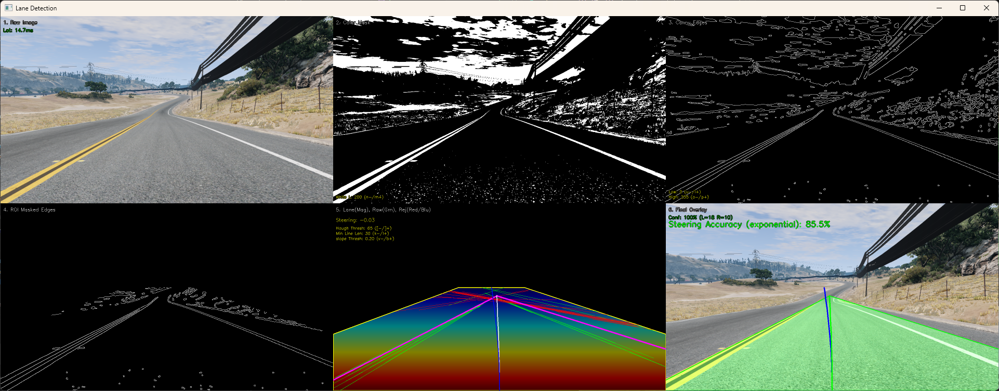
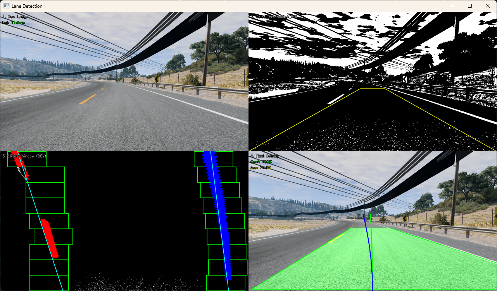
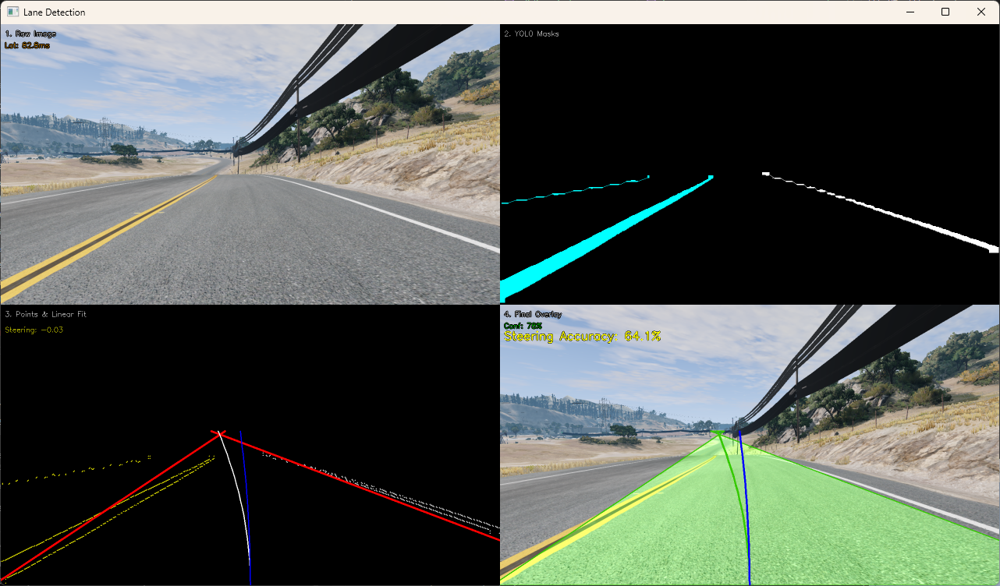

# Lane Detection Methods

## Motivation

Autonomous driving systems rely heavily on robust environment perception. One of the most fundamental tasks is lane detection: identifying the road boundaries to keep the vehicle centered.

This project aims to build a robust lane detection system using a simulated car camera feed (from the simulator game BeamNG.drive). The core problem is to convert fragmented edge detections into continuous linear models for the left and right lanes, even under challenging conditions like partial occlusion, shadows, or noise.

## Approach

Instead of relying on a single method, this project implements and compares three distinct approaches to lane detection, ranging from classical computer vision to modern deep learning:

1.  **Probabilistic Hough Transform**: A classical approach using Canny edge detection and line voting. It is fast, interpretable, and serves as a strong baseline for highway driving.
2.  **Sliding Window (BEV)**: A more advanced classical method that transforms the image to a bird's eye view and uses histogram peaks to trace lanes. Not as robust due to the constant perspective transformation.
3.  **YOLOv8 (Deep Learning)**: A state-of-the-art object detection/segmentation model trained to segment lane lines directly. This was trained on a custom dataset of lane lines during a previous hackathon I attended.

The system is designed as a modular pipeline where detectors can be swapped & added easily to compare performance in real-time.

## Implementation

### Probabilistic Hough Transform

- **Preprocessing**: Applies specific White/Yellow color masks to isolate lane markings.
- **Edge Detection**: Uses Canny Edge Detection on the masked image.
- **ROI Selection**: Dynamically shifts the Region of Interest based on steering input to look ahead into turns. Not strictly necessary, but helps with turns.
- **Line Detection**: Uses `cv2.HoughLinesP` to find line segments.
- **Filtering & Clustering**: Filters lines by slope and length. Clusters valid lines into Left vs. Right lanes.
- **Smoothing**: Applies an exponential moving average to the lane parameters to reduce jitter.

### Sliding Window (BEV)

- **Perspective Transform**: Warps the camera view into a top-down "Bird's Eye View" using a homography matrix. Hard to tune due to the nature of the moving camera angle, distance, and perspective.
- **Histogram Search**: Computes a histogram of pixel intensity in the lower half of the BEV image to find the starting points of lanes.
- **Sliding Windows**: Iteratively moves windows upward, recentering adjacent windows based on pixel density. This works well in some situations, but it also means lines that are close together will interfere with each other.

### YOLOv8 (Deep Learning)

- **Inference**: Runs a custom-trained YOLOv8 model to segment lane, road, and background classes.
- **Post-processing**: Extracts point clouds from the segmentation masks and fits linear models to them.
- **Robustness**: Provides valid detections even when lighting is poor or lines are faded, as it learns context rather than just intensity gradients. However, it is much slower than the classical methods, and not as exact. It tended to struggle detecting lines at the edge of the image. I think this needs some more tuning, especially the current method of linear fitting on the point cloud.

### Comparison Mode

Runs all detectors simultaneously to see side-by-side results.

- **Confidence**: Color-coded polygons (Red=Low, Green=High).
- **Latency**: Performance metrics in milliseconds.
- **Accuracy**: An exponential decay function measuring how close the steering trajectory aligns with the detected lane center.

## Results

The Hough transform performed the best in terms of latency and accuracy, while YOLOv8 was the slowest but provided the most robust detections (although the angle of lines was not as accurate as Hough). The BEV method was the most sensitive to camera angle and perspective, although I believe it could have handled curvature better under the right conditions.

Classical methods (Hough & sliding window) run extremely fast (15ms), while YOLO requires more compute (60ms).

### Visualization Features

Each detector provides a visualization of its results and intermediate steps, which are displayed in a grid. It also displays the steering angle and confidence of the detection, as well as how well the detected lane center aligns with the steering angle.

## Discussion of Problems & Findings

### Challenges Encountered

1.  **Lighting Conditions**: Simple Canny edge detection is very sensitive to shadows. Using specialized color masks (Yellow/White) significantly improved robustness, but it took lots of tuning to get it right.
2.  **Curvature**: The simple Hough transform assumes straight lines. Due to the nature of perspective, this was not an issue in most cases. Lines would approach the middle of the screen as they got further away, even if they curved. However, if the camera was able to see the curvature of the road better (e.g. if the camera was mounted higher), the other methods may have performed better.
3.  **Jitter**: Frame-by-frame detections are noisy. Implementing an exponential moving average was a simple way to smooth the detections.
4.  **Tuning**: The system requires careful tuning of parameters to achieve good performance. Most time was spent tuning the Hough transform parameters, and this may be a reason why it tends to perform better than other methods in terms of steering accuracy (when it detects lanes).

### Future Work

- **Control Logic**: Currently, the system calculates a target trajectory. Implementing a PID controller to actually steer the vehicle in the game would complete the loop.
- **Reinforcement Learning**: Instead of hard-coded detection logic, an RL agent could learn to drive end-to-end from the pixels.

Link to presentation: https://docs.google.com/presentation/d/129qQjQCPUqe-rbknaHc8DhE3KP7iyiEq/edit?usp=sharing&ouid=102405409855704432488&rtpof=true&sd=true
